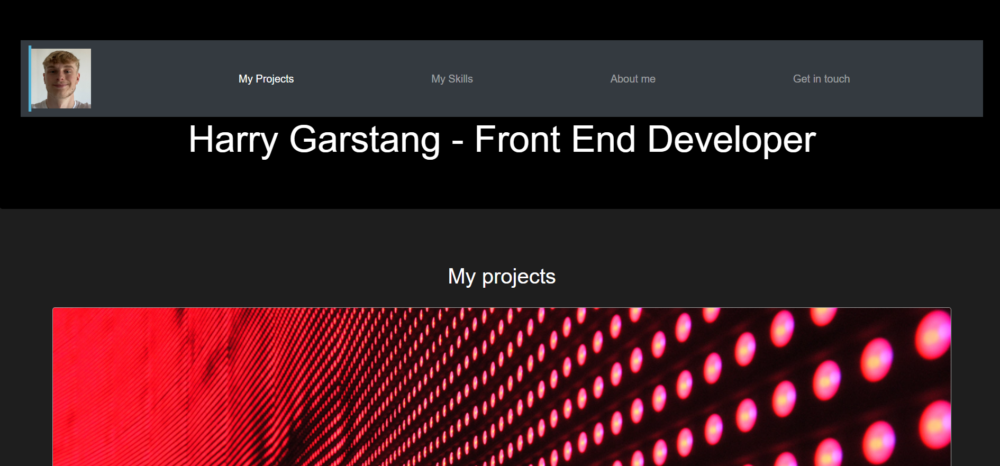

# Bootstrap-Portfolio (Bootcamp Challenge 3)

## Description 
The motivation for this project was to create a portfolio for my work as a developer similar to the previous project, however this time utilising Bootstrap 4.6. 

### Improvements from the previous non-bootstrap portfolio 

* The timeline for the project was much more effecient with Bootstrap's pre-defined classes. 

* Bootstrap not only made it easier to create a portfolio, but also simpler to develop a website that aligns with UX experience design principles. 

### What I have learnt 

* I have learnt the power of Bootstrap to speed up application development. 

* I have learnt to use Bootstrap to create sites that are responsive, and therefore to promote accessability. 

## Usage 
To use this project, please access my Portfolio site at the following link: 

## Credits 

* https://getbootstrap.com/docs/4.6/getting-started/introduction/